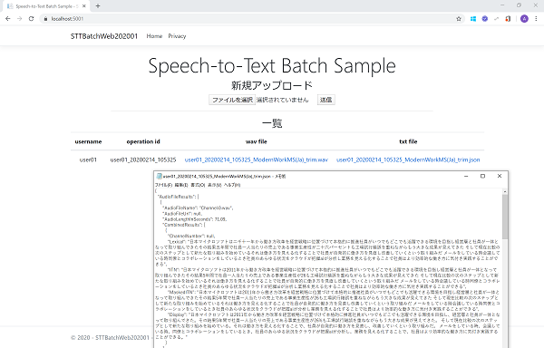

# Cognitive Services Speech Service Batch STT (Speech-to-Txt) Samples


## Solutions

### Speech-to-text by batch using Azure Functions (.NET Core 3.0) (STTBatchFunc)

There are 2 functions;

#### GetTranscriptionFunc.cs

- Kicked by BlobTrigger.
- Post transcription job with wav file in "wav" Blob Container.
- Get transcription result (json) from posted job, and store in "txt" Blob Container.
- Delete transcription job after all.

#### UpdateLogFunc.cs

- Kicked by BlobTrigger.
- Update "log" Table with transcription result.

### Web app to upload voice files to Azure Storage (.NET Core 3.0) (STTBatchWeb)

Simple web app to post wav files to blob storage, and get transcription json files.




## Requrements

- Cognitive Services Speech Service: get Speech Service Key and location.
- Azure Storage (will use Table and Blob storage): get connection string.


## How to use

### STTBatchFunc

Update [local.settings.json](STTBatchFunc202002/local.settings.json) below with your configration;

Replace YOUR_APP_STORAGE_CONNECTION_STRING to your Azure Storage connection string.

```local.settings.json 
    "BlobStorage": "YOUR_APP_STORAGE_CONNECTION_STRING",
    "TableStorage": "YOUR_APP_STORAGE_CONNECTION_STRING",
```

Replace Speech Service setting (Service Key and location).

```local.settings.json 
    "SpeechServiceKey": "YOUR_SPEECH_SERVICE_KEY",
    "SpeechServiceLocation": "YOUR_SPEECH_SERVICE_LOCATION",　//westus, japaneast, etc
```

When deply to Azure, publish with these local settings (using [Visual Studio](https://docs.microsoft.com/en-us/azure/azure-functions/functions-develop-vs#function-app-settings) | [Visual Studio Code](https://docs.microsoft.com/en-us/azure/azure-functions/functions-develop-vs-code?tabs=csharp#application-settings-in-azure) | [Azure Function Core Tools](https://docs.microsoft.com/en-us/azure/azure-functions/functions-run-local?tabs=windows#publish))


### STTBatchWeb

Update [appsettings.Development.json](STTBatchWeb202001/appsettings.Development.json) with your configration;

```appsettings.Development.json
  "StorageConnectionString": "YOUR_APP_STORAGE_CONNECTION_STRING"
```

When deply to Azure, publish this local setting.